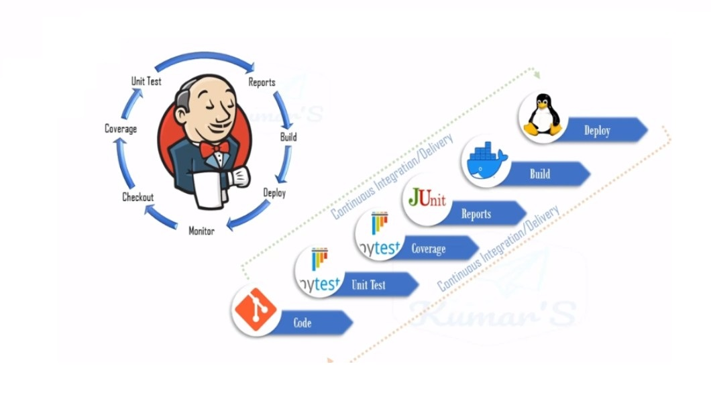
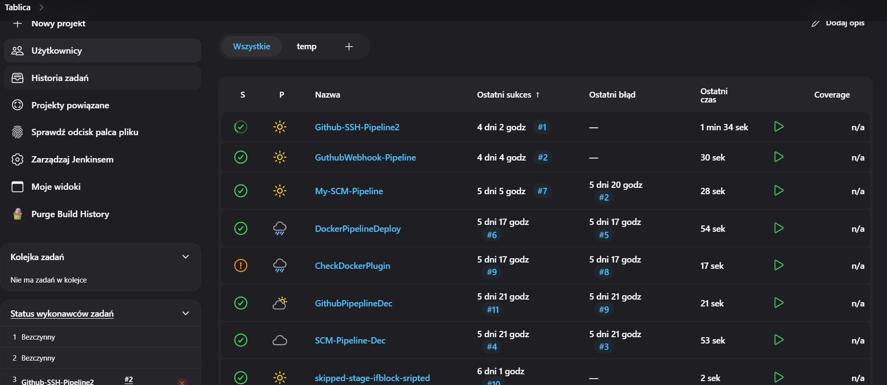
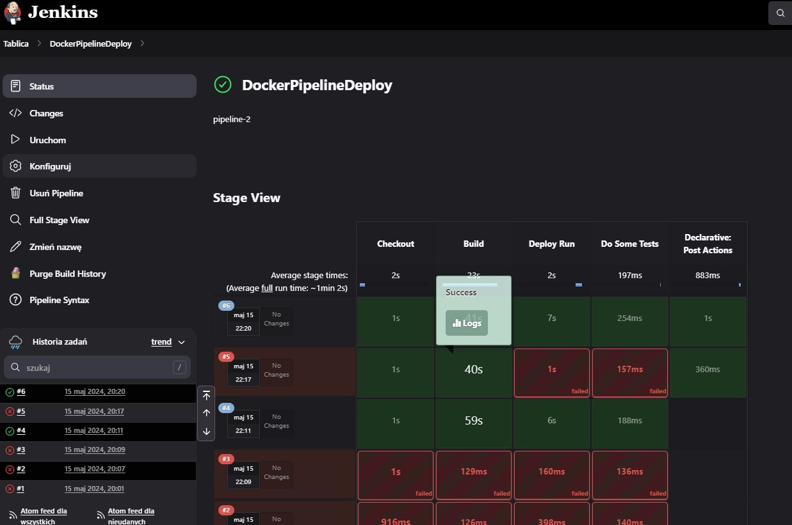
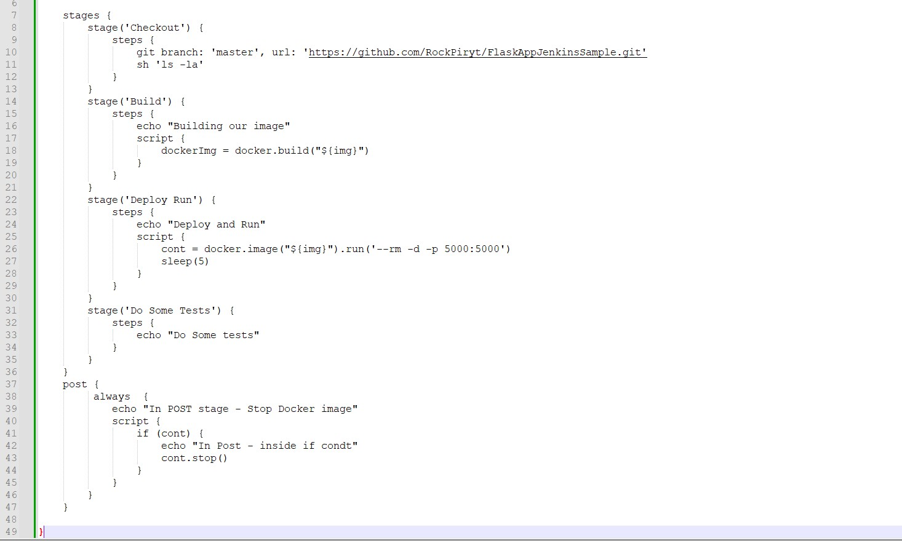
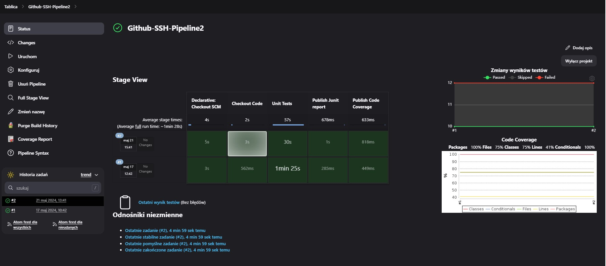
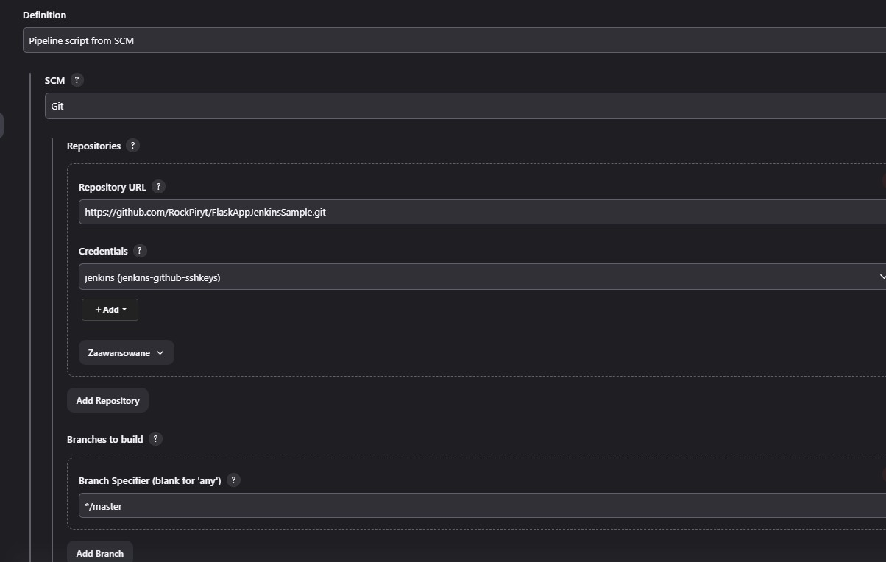
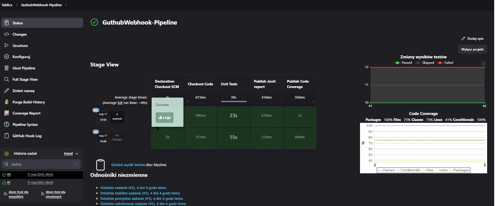

# Project Name
Jenkins Pipelines

## Table of Contents
* [General Info](#general-information)
* [Technologies Used](#technologies-used)
* [Features](#features)
* [Screenshots](#screenshots)
* [Setup](#setup)
* [Usage](#usage)
* [Project Status](#project-status)
* [Unit Testing and Code Coverage](#Unit Testing and Code Coverage)
* [Acknowledgements](#acknowledgements)
* [Contact](#contact)
<!-- * [License](#license) -->

## General Information
- Pipeline with Docker Container
- Pipeline with Github Webhook
- Pipeline With Github SSH
- more pipelines..

## Technologies Used
- Python 3.10.
- Flask: micro-framework for web application development
- SQLAlchemy - ORM (Object Relational Mapper)
- Flask-Bcrypt - password hashing
- Flask-Login - support for user management
- Flask-WTF - simplifies forms

## CI/CD

## Screenshots

Docker Pipeline

Github SSH

Github Webhook

## Setup
pip intall requirements.txt

## Usage

`DirPath/SmartFlaskAPP>python run.py`

## Project Status
Project is: _in progress

## Unit Testing and Code Coverage
- Use pytest to execute unit-tests
pytest --cov=main --junitxml=./xmlReport/output.xml
python -m coverage xml

## Run the App
DirPath/SmartFlaskAPP>python run.py

## Contact
Created by Paulina Kimak

